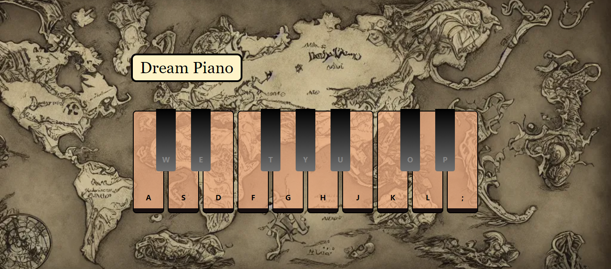

# PORTFOLIO WEBSITE

Welcome to my Github! This website is a piano website.

<div align="center">
  <br />
    <a href="https://piano-org.vercel.app/" target="_blank">
      
    </a>
  <br />

## About Me
I am Mubashir Ali, a passionate designer and developer with a keen interest in creating user-centered digital experiences.


## Connect with Me
- **GitHub**: [mubashir1837](http://github.com/mubashir1837/)
- **LinkedIn**: [Mubashir Ali](https://linkedin.com/in/mubashirali3)
- **Piano**: [PIANO-app](https://piano-org.vercel.app/)

## How to Contribute
If you'd like to contribute to my portfolio website, you can follow these steps:

1. **Fork** the repository.
2. **Clone** the forked repository to your local machine:
    ```
    git clone https://github.com/mubashir1837/piano
    ```
3. Make your changes and enhancements.
4. **Commit** your changes:
    ```
    git commit -am 'Added feature XYZ'
    ```
5. **Push** to your forked repository:
    ```
    git push origin master
    ```
6. Finally, create a new **Pull Request** from your forked repository to the original repository.

Thank you for your contributions!

## License
This project is licensed under the [MIT License](LICENSE).